# About Me

<!---
abhinavbharadwajr/abhinavbharadwajr is a ✨ special ✨ repository because its `README.md` (this file) appears on your GitHub profile.
You can click the Preview link to take a look at your changes.
--->

## Who Am I?

- 👋 Hi, I’m Abhinav Bharadwaj R
- 🎓 I hold a Bachelors Degree specializing in Computer Science and Engineering

## What I do?

- 🧑‍💻 DevOps Engineer @ Servion Global Solutions
- 💻 Code --> Push --> Review --> Commit --> Build --> Deploy
- ⚙️ DevOps / Bash / C and C++ / Java / Python / ACPI / OpenCore

## What do I like to do?

- 🪛 Build Custom PCs - Build Enthusiasist
- 🖥️ Tech Worm - Love reading about newest Tech in Town
- 🎧 Music - nothing else Workouts as Music dose. (Oh, yea and Food 😋 too)
- 📚 Book Reading is a another Favorite Pass Time
- 🫱🏼‍🫲🏼 Looking forward to collaborate on OpenCore for specific hp Systems and Python Programming.

### Some GitHub Stats

### Wanna Know More About me? Check out my [Portfolio](https://abhinavbharadwajr.github.io)

 

  
  
  
  

 

